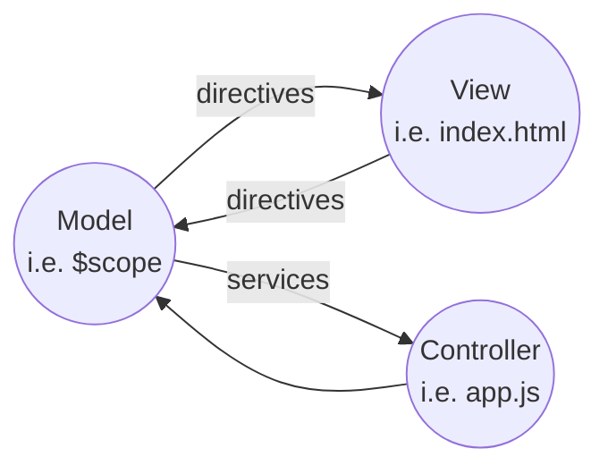

## Introduction
## Controllers
### Summary
- Controllers manipulate scope -- avoiding interacting with html directly
- Add data to a $scope object.
- Binding lifts data into view from scope.
- Controllers can live in a module
- Controllers can use services like $http
    - returns promise objects and get future data using `then`
## Directives and Views
### Introduction
### Philosophy
- The $scope object on the controllers provides the model
    - e.g. `$scope.message = "Hello world" `
- Model does not touch the html
- Data bindings (e.g. `<h1> {{message}} <h1>`) are a type of **Directive**  

Controller and Model are only **concerned with gathering the data** -- the View is only concerned with **presenting the data**. 
Some **Directives** move data from Model to the view, e.g. message text above.
We also have **Directives** that will move data from View to the Model, e.g. on a click event, submit the form data

### ng-model
`ng-model` is a directive that pushes data from the View to the Model. e.g. `ng-model = "username"` will push value of input to the $scope object and `username` property.

### ng-click

We can pass a function with parameters using `ng-click`: e.g. `ng-click="search(username)" `
### ng-repeat  
Use directive ng-repeat to iterate over a collection e.g. `
`
Then we access that `repo` variable to loop through and build table or list on the View. e.g. `<tr>{{ repo.name }}</td>`
### Filters  
- We use Filters to pipe data in models through a filter which can change formatting.  
- We can use **json** filter to do a direct dump of object data into View for debgugging purposes.  
- Several other filters: date, limitTo, number, orderBy  
- We can also use property names in the sortOrder Filter in Model. e.g. `$scope.repoSortOrder = "-starcount";`
  Then use `<ng-repeat="repo in repos | orderBy:repoSortOrder>`

### ng-show and hide
### ng-include
### Directives Summary
- Binding Directives: move text anywhere we need. e.g. `<td>{{repo.name}}</td>`
- Model diretives: move text from input or select to the model: e.g. `<input type="search" ng-model="username" >`
### Summary
## Services
### The Venn of Sevices
- Controllers setup the model (i.e. $scope)
- Views consumes the model
- Directives are an intermediary
  - ng-model gets a value from the Controller into the Model
  - ng-submit pushes a select or input value from the View into the Model
- Services are a "grab bag" if logic doesn't fit in Directives.
  - They offer functionality to Model and Controller
  - Or maybe you need to package up logic in a large Controller into smaller Service.

### Gamification
### Service Roles
### Using $log
### UI Services

Some services interact directly with the UI.

Using $location service. 

- `$location.hash('someHtmlElementId')`
- `$anchorScoll()`: this is invoked and scrolls to the hash added to the URL.

### Custom Services
- create reusable logic
- Create shared data
- Manage complexity

### A GitHub Service

